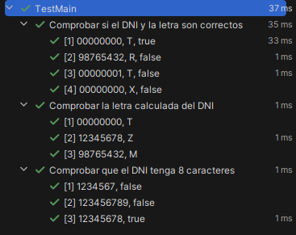

# Examen COD Test Unitarios

## Partes:

##### 1- Los test unitarios de los **dos** métodos, utiliza test **parametrizados**. Suponiendo que la `string` DNI, siempre es un DNI válido.

###### El primerpaso sería crear los siguientes test parametrizados para cada metodo:
```bash
    # Test ComprobarDNI
    @Tag("Correcto")
    @DisplayName("Comprobar si el DNI y la letra son correctos")
    @ParameterizedTest
    @CsvSource({
            "00000000, T, true",  // Correcto
            "98765432, R, false", // Letra equivocada
            "00000001, T, false", // DNI incorrecto
            "00000000, X, false"  // Letra incorrecta
    })
    public void testComprobarDNI(String dni, String letra, boolean esperado) {
        boolean resultado = Main.comprobarDNI(dni, letra.charAt(0));
        assertEquals(esperado, resultado);
    }
    
    
    # Test CalcularLetraDNI
    @Tag("Letra")
    @DisplayName("Comprobar la letra calculada del DNI")
    @ParameterizedTest
    @CsvSource({
            "00000000, T",
            "12345678, Z, false", //Letra erronea
            "98765432, M, false", // Letra erronea
    })
    public void testCalcularLetraDNI(String dni, String letraEsperada) {
        char letraCalculada = Main.calcularLetraDNI(dni);
        assertEquals(letraEsperada.charAt(0), letraCalculada);
    }
```


##### 2- En el código, hay un error, ¿lo pudiste comprabar en los test? ¿Plantea la solución?

###### El error estaba en la longitud del `string` si se pone una longitud mayor de 8, la letra no se calcula correctamente.
###### La solución sería crear una nueva función y un nuevo test para comprobar que la longitud del DNI es correcta.

```bash
    # Función que se debería incluir en el Main para comprobar la longitud y sin caracteres especiales del DNI
    /**
     * Verifica si el DNI tiene exactamente 8 caracteres y solo números sin usar matches()
     * @param dni DNI a verificar
     * @return true si cumple los requisitos, false si no
     */
    public boolean comprobarLongitudYFormatoDNI(String dni) {
        if (dni == null || dni.length() != 8) {
            return false;
        }

        // Verifica que todos los caracteres sean dígitos usando Character.isDigit()
        for (int i = 0; i < dni.length(); i++) {
            if (!Character.isDigit(dni.charAt(i))) {
                return false;
            }
        }
        return true;
    }


    # Test del error encontrado en el programa
    @Tag("Longitud")
    @DisplayName("Comprobar que el DNI tenga 8 caracteres")
    @ParameterizedTest
    @CsvSource({
            "1234567, false",       // Menos de 8 caracteres
            "123456789, false",     // Mas de 8 caracteres
            "12345678, true",       // DNI correcto
            "ABCDEFGH, false",      // Solo letras
            "1234A678, false",      // Mezcla de numeros y letras
            "12-34*678, false",     // Contiene caracteres especiales
            ", false",              // DNI vacio
            "        , false"       // Solo espacios
    })
    public void testComprobarLongitudYFormatoDNI(String dni, boolean esperado) {
        boolean resultado = comprobarLongitudYFormatoDNI(dni);
        assertEquals(esperado, resultado);
    }
```

##### Comprobación de los test:



##### 3- Si no hubiera una comprobación previamente encuanto a la longitud de la `string` del DNI, ¿Qué hay que cambiar en los tests para que comprueben estos casos?
###### En el caso de que no hubiera una comprobación previa de la longitud de los test, estos se debería realizar de la siguiente manera:

```bash
    public static boolean comprobarDNI (String dni, char letra){
        // Verificar longitud del DNI
        if (dni == null || dni.length() != 8 || !dni.matches("[0-9]+")) {
            return false; // Aquí es donde manejamos la longitud y formato
        }
        
        // Calcula la letra del DNI
        char letraCalculada = calcularLetraDNI(dni);
        // Compara la letra del DNI con la letra pasada por parámetro
        return letraCalculada == letra;
    }

    // Método para calcular la letra del DNI
    public static char calcularLetraDNI (String dni) {
        // array de caracteres con las letras del DNI
        char[] letrasDNI = {'T', 'R', 'W', 'A', 'G', 'M', 'Y', 'F', 'P', 'D', 'X', 'B', 'N', 'J', 'Z', 'Q', 'S', 'V', 'H', 'L', 'C', 'K', 'E'};
        // calcula el resto de dividir el DNI entre 23
        int resto = Integer.parseInt(dni) % 23;
        // devuelve la letra correspondiente al resto
        return letrasDNI[resto];
    }
```
